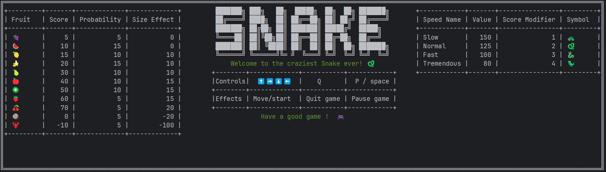
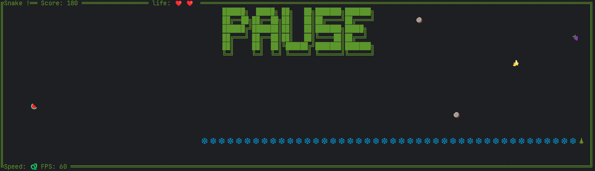

# Snake Game using Ratatui

It is a terminal-based snake game using the Ratatui crate for rendering.



## Features

- **Terminal UI**: Uses Ratatui for rendering a grid-based game.
- **Game Logic**: Manages snake movement, collisions, and scoring.
- **Multithreading**: Uses multiple threads for input handling, rendering at 60 FPS, and game logic execution.
- **Emoji-based graphics**: Supports rendering the snake using emojis instead of ASCII.
- **Configurable parameters**: With `clap` for command-line arguments.

## TODO

- [ ] Add a save score (local db) with a pseudo got from cmdline
- [ ] Add some performance log with tracing, for example
- [ ] Show game options in the menu, and visually change them (tab, direction, using statefulWidget), start entering s
- [ ] Enhance fruits eaten detection and grid management with multiple emojis as body

## Installation Quick path

- Clone this repository
  `git clone <url>`
- Have Rust installed (if not see [Installation Long Path](#installation-long-path-for-windows) below)
- Have a terminal that support emoji (Windows terminal does by default,
  or install noto font on linux, instructions in  [Installation Long Path](#installation-long-path-for-linux) )
- To run the game, run:`cargo run`
- To install the game as a command:  
  `cargo install --path .`  
  And then run the game with: `rsnake`
- To see run options, use: `rsnake --help`
- E.g., `rsnake -z 🐼 -b 🍥` or `cargo run -- -z 🐼 -b 🍥`

## Installation Long Path for Windows

- Install Rust using the official .exe installer https://www.rust-lang.org/tools/install (as it works Out-Of-The-Box on
  windows)
- Emojis are supported by default on Terminal app
- Download the repository (as zip and unzip or using git clone)
- Then follow quick installation instructions

## Installation Long Path for Linux

Make sure your system has `curl` and `git` installed:

```bash
sudo apt update
sudo apt install curl git -y
```

---

## Install Rust

Use the official installer `rustup`, or any alternative method on https://www.rust-lang.org/tools/install (by your own):

```bash
curl --proto '=https' --tlsv1.2 -sSf https://sh.rustup.rs | sh
```

- Follow the prompts in the terminal.
- After installation, restart your terminal or run:

```bash
source "$HOME/.cargo/env"
```

- Verify the installation:

```bash
rustc --version
```

---

## Enable Emoji Font Support

To properly display emoji characters in your terminal and system fonts, install an emoji-compatible font.

### For Ubuntu/Debian-based distros:

```bash
sudo apt install fonts-noto-color-emoji
```

### For Arch Linux:

```bash
sudo pacman -S noto-fonts-emoji
```

### For Fedora:

```bash
sudo dnf install google-noto-emoji-color-fonts
```

---

## Optional: Configure Font Fallback (if emojis still don’t render)

Create or edit the following file:

```bash
~/.config/fontconfig/fonts.conf
```

Add:

```xml
<?xml version="1.0"?>
<!DOCTYPE fontconfig SYSTEM "fonts.dtd">
<fontconfig>
    <alias>
        <family>sans-serif</family>
        <prefer>
            <family>Noto Color Emoji</family>
        </prefer>
    </alias>
</fontconfig>
```

Then refresh the font cache:

```bash
fc-cache -f -v
```

---

## Test Your Setup

Run:

```bash
echo "Rust is awesome! 🦀🔥🚀"
```

You should see emojis rendered correctly in your terminal or text editors.

- Then follow quick installation instructions

## Architecture

- Uses `Arc` & `RwLock` for synchronization.
- Spawns separate threads for input handling, rendering (60Hz), and game logic execution.

## Documentation generation

- `cargo doc --document-private-items --no-deps --open`

## Tests

- As usual run them with `cargo test` the project is set up with a lib containing all the code, and a main.rs just
  calling it
- As this is a widespread pattern providing full compliance with the Rust test ecosystem, allowing doc comment to be
  automatically tested, for example.

## References

- Clippy lints: <https://github.com/rust-lang/rust-clippy/>
- Ratatui tutorial: <https://ratatui.rs/tutorials/hello-world/>
- Example: <https://ratatui.rs/examples/widgets/canvas/>